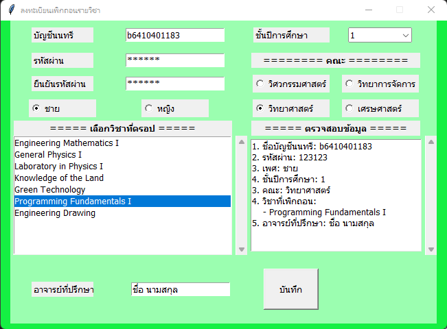

# Time-To-Drop
Kasetsart University Students' Course Drop Recording Program


## Installation
   ```
   git clone https://github.com/ong22280/Time-To-Drop.git
   ```

## Run the program

```
python3 Drop.py
```

## Library used
- [tkinter](https://docs.python.org/3/library/tkinter.html)

## Project structure
```
|   DATABASE  with python3.pptx
|   Drop.py
|   Presentation_46.mp4
|   Project
|   README.md
|   SQL_Drop.db
|   Structure.txt
|   
\---.idea
    |   modules.xml
    |   Project_Drop.iml
    |   
    \---inspectionProfiles
            profiles_settings.xml
```